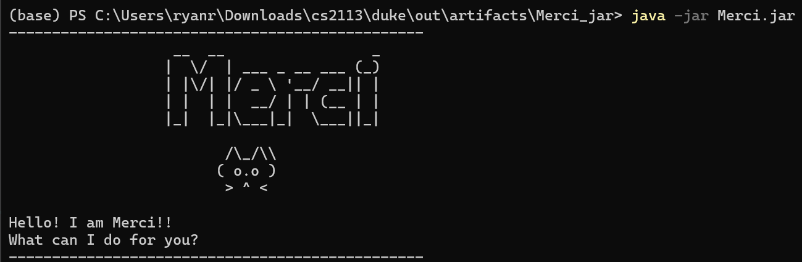
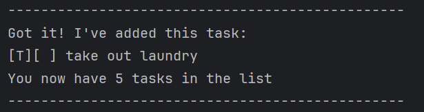
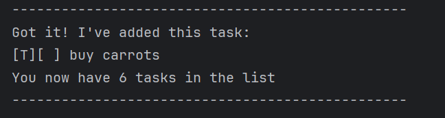
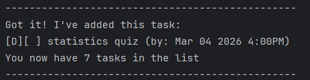
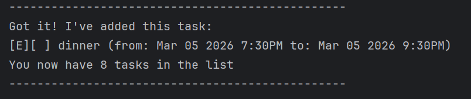
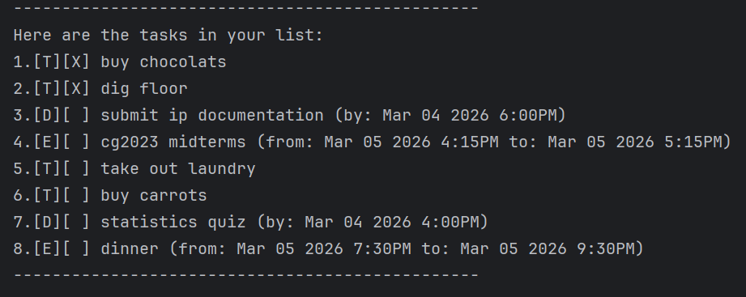
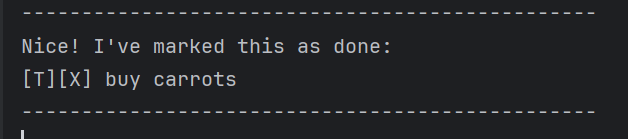
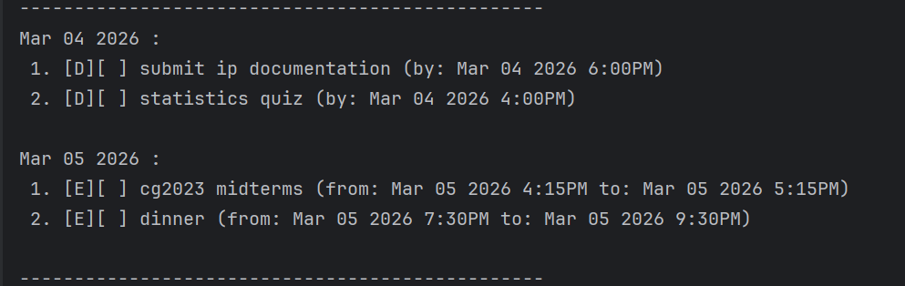
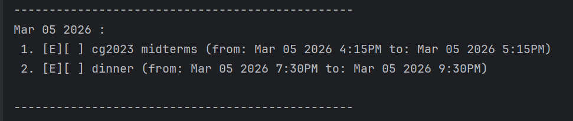
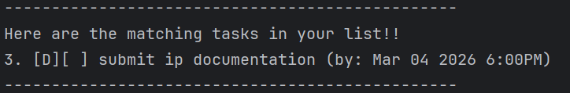

# Merci User Guide

Merci is a personalised chatbot that helps users to keep track of their to-do list. 

It has multiple features such as adding todos, deadlines and events, marking or unmarking tasks, listing tasks as well 
as scheduling based on chronological order of date. Merci can also list out all events on a specific 
date. Lastly Merci is able to find tasks based on 
searching for the keyword. 

## Todos
A type of task that Merci can keep track of. It does not have any date associated 
with it.

**Format**: todo **[TASK]**

**Examples**: 

Input: todo take out laundry. 

Output: 

Input: todo buy carrots

Output: 

## Deadlines

A type of task where the user has to input a deadline for it to be done by.

**Format**: 

deadline **[TASK]** /by **[date in yyyy-mm-dd format, time in 4pm/ 4:00pm/ 1600 format]**

**Examples**:

Input: deadline statistics quiz /by 2026-03-04 4pm

Output: 

## Events

Events are a type of task that have a start and end date that the user has to key in.

Format: event **[TASK]** /from **[date in yyyy-mm-dd format, time in 4pm/ 4:00pm/ 1600 format]** 
/to **[date in yyyy-mm-dd format, time in 4pm/ 4:00pm/ 1600 format]**

**Example**

Input: event dinner /from 2026-03-05 7:30pm /to 2026-03-05 9:30pm

Output: 

## Listing

The user can view a list of tasks that Merci has recorded for them. It is ordered from 1 
to whichever it is the latest task added. Listing will also show the completion status of 
the task.

Format: list

**Example**:

Input: list

Output:

## Marking and unamrking

The user can mark and unmark tasks in their list based on whether they have completed them or not.

Format: mark/ unmark **[TASK NUMBER]**

**Example**:

Input: mark 6

Output: 

## Schedule

User can type schedule to get an output of their list of tasks in chronological order of date.
For deadlines, the tasks are scheduled based on their /by date. For events, tasks are shceduled
based on their /from date. todos are ignored for this feature.

The user can also optionally search for the tasks occurring on a specific date by giving Merci 
an input date. Merci will give an output of the tasks occurring on that specific date.

Format: schedule/ schedule **[date in yyyy-mm-dd format]**

**Example**:

Input: schedule

Output: 

Input: schedule 2026-03-05

Output:

## Find

Merci can find tasks based on a keyword given by the user.

Format: find **[KEYWORD]**

**Example**:

Input: find documentation

Output: 

